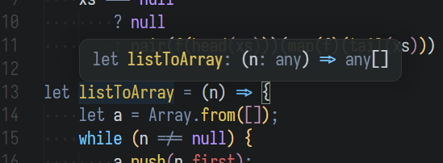

#  Owokai Themes

Originally a fork of Monokai theme, now a standalone theme pack :3c

| Owokai                                      | Owokai Alt                                     |
| ------------------------------------------- | ---------------------------------------------- |
| Small, yellow color palette                 | Extended, blue color palette                   |
|  |  |

For updates, see [Changelog](https://github.com/toiletbril/Owokai/blob/HEAD/CHANGELOG.md).

## Installation

This extension is available from VSCode marketplace.

```
ext install owokai-theme
```

## (Experimental) Custom CSS

I always disliked VSCode's square corners, so i made them more round.



To make this work, you will need to add contents of [custom.css](./custom.css) to your editor's CSS. To achieve this, you can use [other extensions](https://github.com/be5invis/vscode-custom-css) that let you do that (for now).
